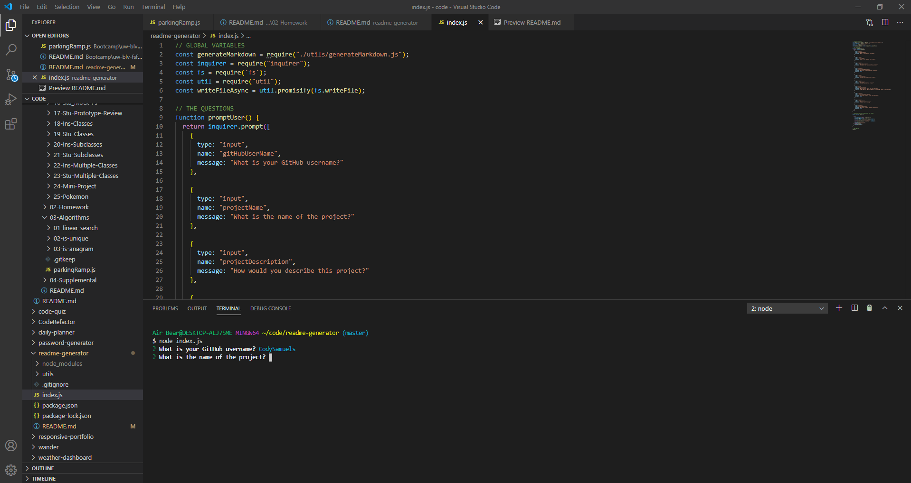

  # README-generator  

  ## Description
    This generates a basic README template that can be fleshed out to create a concise and useful README.

  ## Screenshot of the Deployed Application  
  
  
  ## Table of Contents
  
  1. [Installation](#Installation)
  2. [Usage](#Usage)
  3. [Tests](#Tests)
  4. [Contributing](#Contributing)
  5. [Acknowledgements](#Acknowledgements)
  6. [Questions](#Questions)

  

  ## Installation
  [Intallation Video](https://drive.google.com/file/d/1dwzlDfxg3-XC1g0V89JrcU_TxbGkail3/view?usp=sharing)
  
    Download the repo off of GitHub. node install. etc.

  
  ## Usage
  [How to use Video](https://drive.google.com/file/d/1HZlUHFgxIwMKxz2Zh2nRL-OUsQhQO6DG/view?usp=sharing)
    You run it from the command line and follow the prompts. Use node index.js.
  
  ## Tests
  
    npm tests
  
  ## Contributing
  
    If you would like to contribute to this repository, please first discuss the changes you would like to make with a developer. You can merge a pull request after the review of at least two developers.
  
  ## Acknowledgements
  
  [CodySamuels](https://www.github.com/CodySamuels), the author.
  [README-Generator](https://www.github.com/CodySamuels/readme-generator), the project

  
  ## Questions

    You can ask any questions at twowoodenspoons@gmail.com